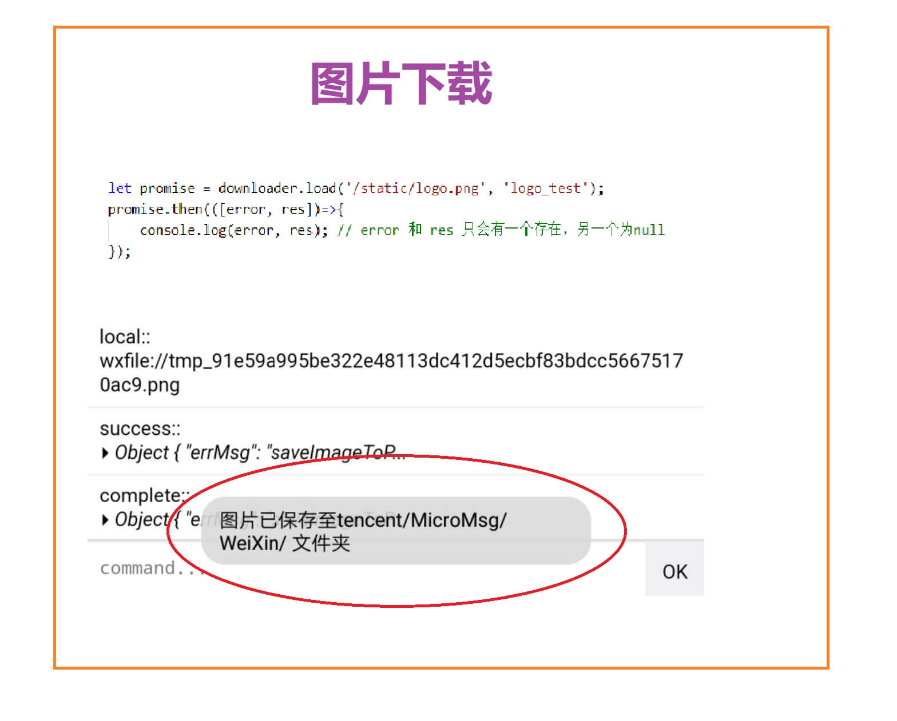

# hx_uniapp_img-downloader

这是 `HBuilerX` 的插件， 使用环境为 `uni-app`。  
将网络或项目中的图片下载到本地 兼容 `h5` `小程序` `app`。  
  
  
## 背景 
前段时间在做的一个项目，看视频学习，学习完成后会生成图片证书，然后点击可以下载保存到本地。  
感觉这个功能也挺常用的，这两天专门详细测试了其中用到的两个方法:   
`uni.downloadFile` 和 `uni.saveImageToPhotosAlbum`，然后封装的这个插件。  
希望对大家有用。  

## 获取
github仓库: [https://github.com/xiafl/hx_uniapp_img-downloader](https://github.com/xiafl/hx_uniapp_img-downloader)  
  
npm安装: `npm install @xfl/hx_uniapp_img-downloader`  
  
## 使用方法
  
```
import downloader from 'img-downloader';
let promise = downloader.load(url, imgName);  
promise.then(([err, res])=>{    
    console.log(err, res);  // err 和 res 只会有一个存在，另一个为null  
});
```
  
## 效果



## 注意事项 
1. 没有下载进度。  
2. web端会有跨域问题。  
3. 支持 http 或 https 开头的绝对路径， 也支持 `/static/aa.png` 或 `static/aa.png` 这种项目中的相对路径。  
4. 不支持支付宝小程序。  
5. 只在 google浏览器 、 微信小程序开发者工具 、手机微信小程序 中测试过。只测试过下载图片，应该不支持下载其它文件。  
6. load 函数返回的是一个 `promise` 对象，并且一般只会回调 then , 不会回调 catch, 除非你自己在 then中写的代码报错了。  
7. 注意，在微信小程序中，第一次调用相册会弹出授权弹框，如果用户本次拒绝授权，则本次下载失败，并且下次再调用时，不会再弹授权框，而是直接下载失败。  
8. 只有在 web 端，才能重命名下载的图片的名字。  
9. 在 web 端，回调 then 时，其实只是 说明开始下载了，至于是否会下载成功，则是未知的。  

## 权限
本插件需要申请的手机端权限列表：  
1. 系统相册权限: `scope.writePhotosAlbum` 

## 问题反馈
如在使用中发现bug或有优化的建议和意见，请发邮件 <541151284@qq.com> 或在 [gitHub](https://github.com/xiafl/hx_uniapp_img-downloader) 上反馈。
  
## 更新日志
  
2019.6.1 v1.1.0  重构了代码、创建了 [示例页面](http://raw.githack.com/xiafl/hx_uniapp_img-downloader/master/test_downloader/unpackage/dist/build/h5/index.html) 、添加 [jsDoc](http://www.dba.cn/book/jsdoc/) 注释  
  
2019.5.10 v1.0.0  创建本插件  
  